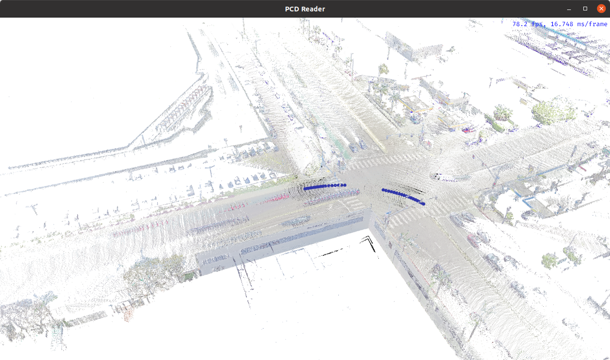
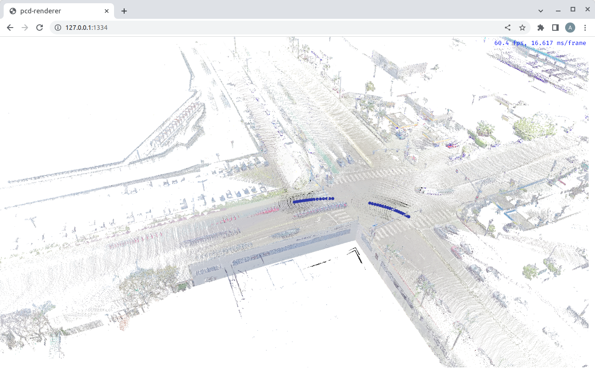

# bye_pcd_viewer_rs

`bye_pcd_viewer_rs` 是一个基于 [Bevy Engine](https://bevyengine.org/) 的应用程序，用于预览点云，既可以作为原生应用程序运行，也可以在浏览器中运行。

### 开发环境
该项目需要在开发机器上配置以下工具：
- Git LFS
- Rust 编译器和 Cargo，安装方法请参考 [Rust 官网](https://www.rust-lang.org/tools/install)
- 安装 wasm 目标：`rustup target add wasm32-unknown-unknown`
- 安装 wasm-server-runner：`cargo install wasm-server-runner`
- 安装 wasm-bindgen-cli：`cargo install -f wasm-bindgen-cli --version 0.2.95`

### 如何编译和运行原生版本
```bash
➜  render-pcd-rs git:(main) ✗ cargo run
```

编译并运行后，你应该会看到：


### 如何编译和运行浏览器版本
```bash
➜  render-pcd-rs git:(main) ✗ cargo run --target wasm32-unknown-unknown
...
    Finished dev [optimized + debuginfo] target(s) in 9.87s
     Running `wasm-server-runner target/wasm32-unknown-unknown/debug/pcd-renderer.wasm`
 INFO wasm_server_runner: compressed wasm output is 5.67mb large
 INFO wasm_server_runner::server: starting webserver at http://127.0.0.1:1334
```
预构建版本在[bye_pcd_viewer_rs.wasm](./www/bye_pcd_viewer_rs.wasm)

在浏览器中打开链接 http://127.0.0.1:1334，你应该会看到：


### WASM 相关问题
如果你在控制台中看到类似以下错误：
```
     Running `wasm-server-runner target/wasm32-unknown-unknown/debug/pcd-renderer.wasm`
thread 'main' panicked at 'index out of bounds: the len is 0 but the index is 0', /home/user/.cargo/registry/src/github.com-1ecc6299db9ec823/wasm-bindgen-cli-support-0.2.83/src/descriptor.rs:208:15
stack backtrace:
   0: rust_begin_unwind
             at /rustc/a55dd71d5fb0ec5a6a3a9e8c27b2127ba491ce52/library/std/src/panicking.rs:584:5
   1: core::panicking::panic_fmt
             at /rustc/a55dd71d5fb0ec5a6a3a9e8c27b2127ba491ce52/library/core/src/panicking.rs:142:14
   2: core::panicking::panic_bounds_check
             at /rustc/a55dd71d5fb0ec5a6a3a9e8c27b2127ba491ce52/library/core/src/panicking.rs:84:5
   3: wasm_bindgen_cli_support::descriptor::Descriptor::_decode
   4: wasm_bindgen_cli_support::descriptor::Function::decode
   5: wasm_bindgen_cli_support::descriptor::Descriptor::_decode
   6: wasm_bindgen_cli_support::descriptor::Descriptor::decode
   7: wasm_bindgen_cli_support::Bindgen::generate_output
   8: wasm_server_runner::wasm_bindgen::generate
   9: wasm_server_runner::main
note: Some details are omitted, run with `RUST_BACKTRACE=full` for a verbose backtrace.
```

可以尝试卸载并重新安装 `wasm-server-runner